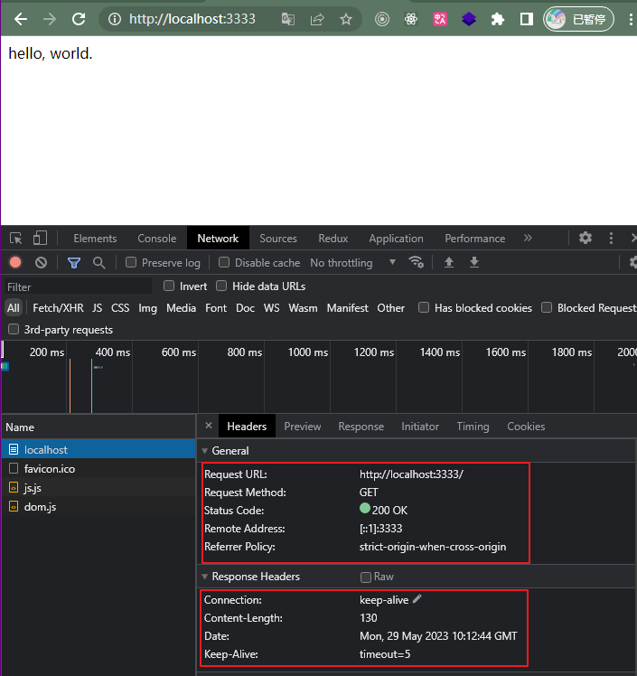

# 简单部署

## HTML

### 通过 CURl 获取 index 文件中的 Response message

```bash
# curl -vvv [文件地址]

# 例如 index.html：
curl -vvv http://127.0.0.1:5500/%E5%89%8D%E7%AB%AF%E9%83%A8%E7%BD%B2/1.%E7%AE%80%E5%8D%95%E9%83%A8%E7%BD%B2/1_html.html
```

#### 返回的响应报文


```bash
*   Trying 127.0.0.1:5500...
* Connected to 127.0.0.1 (127.0.0.1) port 5500 (#0)
> GET /%E5%89%8D%E7%AB%AF%E9%83%A8%E7%BD%B2/1.%E7%AE%80%E5%8D%95%E9%83%A8%E7%BD%B2/1_html.html HTTP/1.1
> Host: 127.0.0.1:5500
> User-Agent: curl/8.0.1
> Accept: */*
>
< HTTP/1.1 200 OK
< Vary: Origin
< Access-Control-Allow-Credentials: true
< Accept-Ranges: bytes
< Cache-Control: public, max-age=0
< Last-Modified: Mon, 29 May 2023 09:56:12 GMT
< ETag: W/"92-18866efd09b"
< Content-Type: text/html; charset=UTF-8
< Content-Length: 1639
< Date: Mon, 29 May 2023 09:56:14 GMT
< Connection: keep-alive
< Keep-Alive: timeout=5
<
<!DOCTYPE html>
<html lang="en">
        <head>
                <meta charset="UTF-8" />
                <title></title>
        </head>
        <body>
                hello, world.
        <!-- Code injected by live-server -->
<script>
        // <![CDATA[  <-- For SVG support
        if ('WebSocket' in window) {
                (function () {
                        function refreshCSS() {
                                var sheets = [].slice.call(document.getElementsByTagName("link"));
                                var head = document.getElementsByTagName("head")[0];
                                for (var i = 0; i < sheets.length; ++i) {
                                        var elem = sheets[i];
                                        var parent = elem.parentElement || head;
                                        parent.removeChild(elem);
                                        var rel = elem.rel;
                                        if (elem.href && typeof rel != "string" || rel.length == 0 || rel.toLowerCase() == "stylesheet") {
                                                var url = elem.href.replace(/(&|\?)_cacheOverride=\d+/, '');
                                                elem.href = url + (url.indexOf('?') >= 0 ? '&' : '?') + '_cacheOverride=' + (new Date().valueOf());
                                        }
                                        parent.appendChild(elem);
                                }
                        }
                        var protocol = window.location.protocol === 'http:' ? 'ws://' : 'wss://';
                        var address = protocol + window.location.host + window.location.pathname + '/ws';
                        var socket = new WebSocket(address);
                        socket.onmessage = function (msg) {
                                if (msg.data == 'reload') window.location.reload();
                                else if (msg.data == 'refreshcss') refreshCSS();
                        };
                        if (sessionStorage && !sessionStorage.getItem('IsThisFirstTime_Log_From_LiveServer')) {
                                console.log('Live reload enabled.');
                                sessionStorage.setItem('IsThisFirstTime_Log_From_LiveServer', true);
                        }
                })();
        }
        else {
                console.error('Upgrade your browser. This Browser is NOT supported WebSocket for Live-Reloading.');
        }
        // ]]>
</script>
</body>
</html>
* Connection #0 to host 127.0.0.1 left intact
```

## Node

### 执行

```bash
npm start
# or
node 2_node.js
```

#### 执行结果



## 完备的静态资源服务器

### 静态资源服务器要满足的基本条件

-   地址后缀清除
-   排行栈
-   重写
-   重定向
-   缓存
-   跨域


